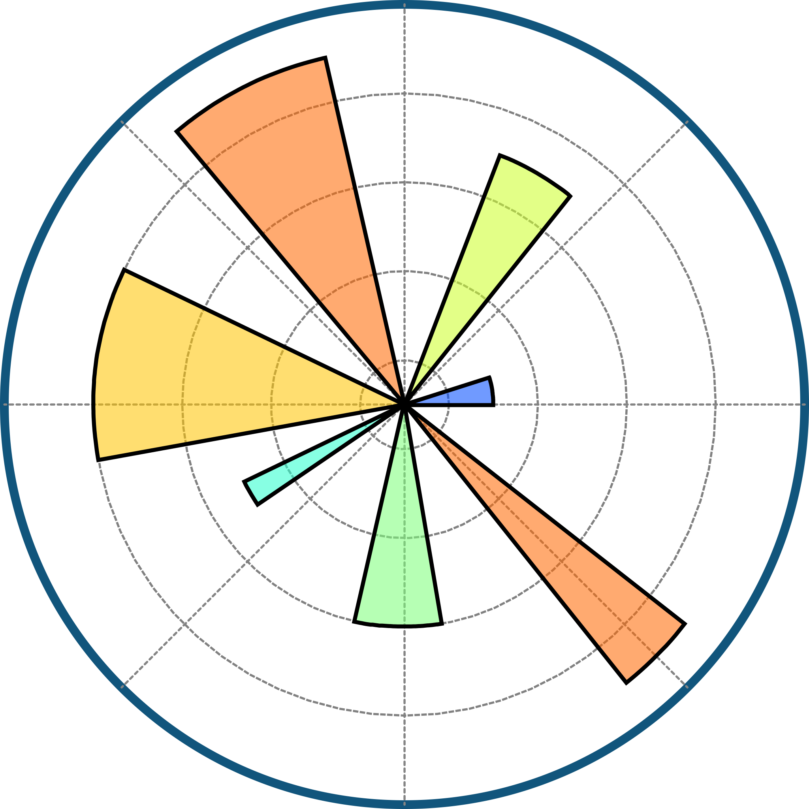

<h1 align="center">
    
</h1>

  
  
  

 

<h2 align="center" style="color:#4CAF50">🌟 PROFILE 🌟</h2>

<table align="center" width="90%" cellpadding="10" cellspacing="10">
  <tr>
    <td style="text-align: justify;">
      
Hi! I'm Pinkrah Nana Ofosuhene, a Teaching and Research Assistant in the Department of Meteorology and Climate Science at Kwame Nkrumah University of Science and Technology (KNUST), Ghana. I'm passionate about understanding and mitigating the impacts of climate change, with a focus on meteorology in the tropics, climate dynamics, and boundary layer meteorology.

      
My research involves studying heatwave trends across various regions in Ghana (Bole, Navrongo, Wa, Walewale, Yendi), especially under different climate scenarios like RCP 8.5 and RCP 2.6. My project explores how future climate conditions will influence heatwaves, making it essential for building resilience in local communities.

      
I’ve also worked on an SEIR model for HIV/AIDS in Ghana, focusing on ensuring the model reflects real-world dynamics with accurate constraints. My goal is to produce research that not only adds to the field of climate science but also contributes to effective decision-making.

    </td>
  </tr>

  <tr>
    <td style="text-align: justify;">
      
👨‍🏫 As a facilitator at Gumption Ex, I mentor students and teach programming languages such as Python for data analysis, weather forecasting, and climate simulations. I'm proficient in C++, using it to program traffic lights and simulate vehicle movements with Arduino. Sharing my skills and knowledge with others is something I truly enjoy.

      
🖥️ In addition, I will soon begin training young minds in programming, and I run a YouTube channel where I teach Python and CDO. I am committed to education and pride myself on my ability to explain complex concepts in simple, accessible ways.

    </td>
  </tr>

  <tr>
    <td style="text-align: justify;">
      
💼 I am a dedicated researcher, skilled programmer, and inspiring mentor. I aim to make a meaningful impact in climate science, epidemiology, and education by contributing my expertise and empowering others through mentorship and hands-on learning.

    </td>
  </tr>

  <tr>
    <td style="text-align: center;">
      💬 Feel free to ask me any questions! I’m always eager to collaborate and solve challenging problems.
    </td>
  </tr>

  <tr>
    <td style="text-align: center;">
      📧 You can reach me at pinkrahnanaofosuhene9690@gmail.com or nopinkrah@st.knust.edu.gh. Let's have an engaging conversation about science, data, and creative development!
    </td>
  </tr>
</table>

<h2 align="center" style="color: #4CAF50">🔥 SKILLS & TOOLS 🔥</h2>

  
  
  
  
  
  
  
  
  
  

<h2 align="center" style="color: #4CAF50">📊 GITHUB STATS 📊</h2>

  
  

  

  

<h3 align="center"> 
   👀 Visitors Count: 
</h3>

 
  

